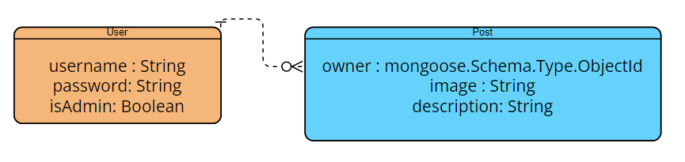
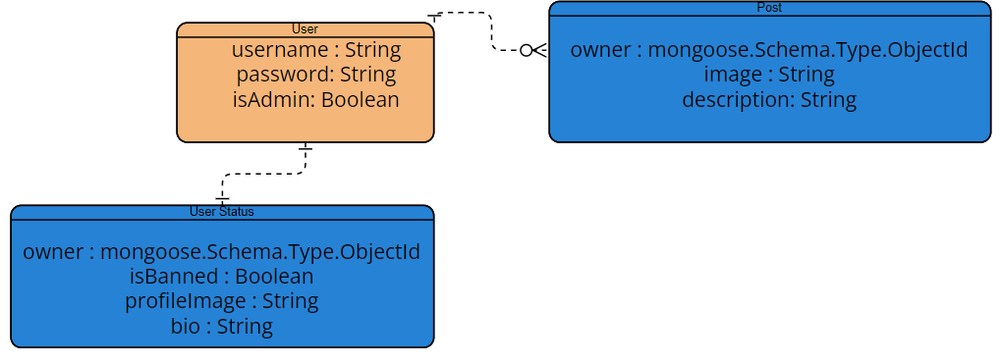

The project is a social media web application built with the MEN stack (MongoDB, Express.js, Node.js). Users can create accounts, securely log in, post content including images, and manage their profiles and posts.

#### User Story
- The user must be able to create an account.
- The user must be able to sign in into his account.
- The user must be able to create, update and delete posts.
- The user can upload images.
- The users can view the date of upload.
- The users can view other users account.
- The user can see if the post got edited.
- The community must be moderated through an admin that can delete both users and posts.
- The admin can create admin.

#### Pseudo code
- Create the project repo
- Create structure files
- Install and require modules 
- Create user model
- Create post model
- Create a home page.
- Create navigation partial
- Create user page
- Create sign up and sign in mechanism
- Apply session based authentication
- Creating post mechanism for the user
- Deleting post mechanism for the user
- Viewing post mechanism for the user
- Name editing mechanism for the user
- Email editing mechanism for the user
- Create an admin user with the ability to delete posts.

#### Extra features 
- Like mechanism
- The User can add profile picture
- The User can create a bio
- The User can follow 
- The User can see his followers

